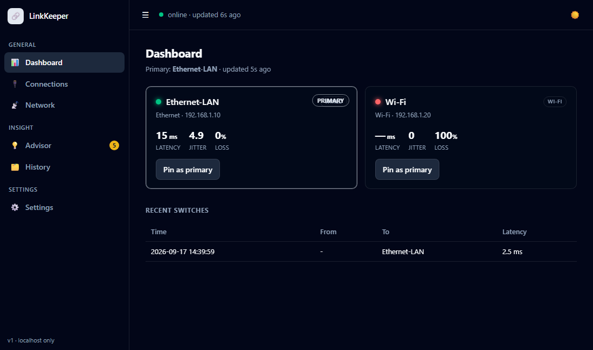

# LinkKeeper

**Keep a Windows PC's internet always on.**

LinkKeeper watches every wired and wireless link you have — Ethernet, USB tether,
Wi-Fi hotspot, Bluetooth, even (opt-in) open Wi-Fi — health-checks each one for
**real internet**, and hands the PC whichever is genuinely best. When a link
degrades or dies, it fails over in seconds. Install once and forget it.




- 🔎 **Never stops scanning** — auto-discovers any interface that provides internet
- 🩺 **Health-checks each link for real internet** over its *own* pinned route — so
  it catches the "connected but no internet" failure Windows itself is blind to
- ⚡ **Always the best link** — wired-first, then lowest latency + jitter + loss,
  with anti-flap hysteresis
- 🔁 **Self-healing** — reconnects dropped Wi-Fi, revives stale USB tethers
- 💡 **Advisor** — tells you *why* a link died, with the exact per-device fix
- 🔒 **Local & private** — no subscription, no VPN, no traffic through anyone's servers

> **Freshly public — testers wanted.** This just came out of a private repo after months of daily
> personal use, but it's only been run on its author's own hardware/link combos so far. If you try
> it on a different setup (different phones, carriers, adapters), an
> [issue](../../issues/new/choose) about anything that breaks — or even just "worked fine on X" —
> is genuinely useful. See [CONTRIBUTING.md](CONTRIBUTING.md).

## Quick start

```powershell
git clone https://github.com/kamitksoftkengkineerk/linkkeeper
cd linkkeeper
python linkkeeper.py --status          # see your links right now (no admin needed)

# install it for real (elevated PowerShell) — runs at every login
.\install_task.ps1 -Run
python dashboard.py                    # control panel: http://127.0.0.1:8901
```

First run copies `config.example.json` → `config.json` (yours, gitignored) and the
dashboard's setup wizard walks you through the rest. Requires Windows + Python 3.10+.
The daemon needs admin (it rewrites interface metrics); the dashboard doesn't.

## Why LinkKeeper — is there anything like it?

Short answer: not in this exact slot. The thing that makes it different is that
it **verifies real internet on each link independently** — so it catches the
"gray failure" where a cable or Wi-Fi is *connected but has no internet*, which
the free built-in options are blind to.

| Solution | Free? | Checks *real internet* per link? | Any connection (wired/Wi-Fi/tether/BT)? | Local & private? |
|---|---|---|---|---|
| **LinkKeeper** | ✅ | ✅ per-link over its own pinned route | ✅ auto-discovers all | ✅ self-hosted |
| **Speedify** | ❌ subscription | ✅ | ✅ | ❌ routes through their VPN |
| **Windows Interface Metric** | ✅ built-in | ❌ **link-up only** | wired + Wi-Fi | ✅ |
| **Intel Killer DoubleShot** | bundled | partial | needs Killer NIC hardware | ✅ |
| **Wireless AutoSwitch** | trial | ❌ | just toggles Wi-Fi off on LAN | ✅ |
| **Dual-WAN routers / pfSense** | varies | ✅ | router-level, not per-PC | ✅ |

**What's genuinely unique**

1. **Real-internet health checks per link.** Each link is probed over its *own*
   pinned route, so a connected-but-dead link is caught and failed away from.
   Windows' built-in metric method only sees "link up" and will happily sit on a
   dead connection. This is the hardest part (Windows' weak-host model) and the
   main reason LinkKeeper exists.
2. **Free, local, private.** No subscription, no VPS, no VPN middleman routing
   your traffic through someone else's servers.
3. **The Advisor.** Nothing else *diagnoses why* a link dropped and hands you the
   exact per-device fix (Samsung/OnePlus/Windows keep-alive settings).
4. **Connection-agnostic.** Best link across USB tether, Ethernet, Wi-Fi,
   Bluetooth, even opt-in open Wi-Fi — not Wi-Fi-only like most tools.

**Honest gaps (what paid tools still beat us on):** Speedify *bonds* links to
combine their speed (LinkKeeper does failover, not aggregation — bonding needs a
server); LinkKeeper is Windows-only for now (Linux/Mac planned); and it's a
sharp personal tool, not a supported product.

**Verdict:** for "free, self-hosted, always-scanning, health-monitored,
any-connection, loyal-to-one-PC," there is essentially nothing equivalent. The
closest is Speedify (paid, VPN-routed, bonding-first); the only free alternative
is Windows' static metric, which is blind to the exact failure LinkKeeper solves.

## Control panel (http://127.0.0.1:8901)

A vanilla single-page app with a sidebar: **Dashboard** (live links, primary,
switch history), **Connections** (the full saved registry), **Advisor** (why a
link dropped + exact per-device fixes), and **Settings** (edit behavior live).
A **first-run wizard** walks setup: detect connections → apply Windows
keep-alive fixes → optional open-Wi-Fi → install autostart. The unelevated UI
asks the elevated daemon to do privileged work over a file-based command
channel (`commandbus.py`); POSTs are localhost-only and all network-derived
text is HTML-escaped.

## Open Wi-Fi (opt-in, untrusted, last resort)

Off by default. When enabled in Settings, and **only** when every phone link is
down, LinkKeeper scans for a password-free network, joins one that passes a
captive-portal + real-internet check, uses it as an **untrusted** link (never
ranked above your phones), and drops it the instant a phone is back. Scanning
needs Windows Location on (the wizard/advisor prompts for it).

## How it works

1. Discovers every interface that owns a default route (your USB tether + Wi-Fi
   hotspot).
2. Every few seconds, TCP-connects to `1.1.1.1` / `8.8.8.8` / `9.9.9.9`
   **bound to each link's own IP**, measuring latency + loss.
3. Picks the best healthy link (preference, then latency) and points Windows'
   default route at it by rewriting the interface **metric**. Failover away is
   fast; switch-back waits out a dwell time so links don't flap.

## Physical setup (any combination works)

LinkKeeper doesn't care *what* your links are — it discovers whatever provides
internet. Common setups:

- **Wired broadband + phone backup** — Ethernet as the fast primary, a phone
  hotspot or USB tether as the failover.
- **Two phones** — one USB-tethered, the other on Wi-Fi hotspot.
- **Different carriers on each link** — so one carrier's outage can't take you
  offline. This matters more than raw speed.

Tips that make a real difference:

- **USB tether beats Wi-Fi hotspot** for the always-on link: it charges the phone
  and has no "turn off when no devices are connected" idle timer.
- On the phone, set **Developer options → Default USB configuration → USB
  tethering** — otherwise Android turns tethering off on *every* cable event.
- Use a real **data** cable in a rear USB port (charge-only cables fail silently),
  and keep the phone's own Wi-Fi off while USB tethering so it can't steal the
  upstream.

See **[GUIDE.md](GUIDE.md)** for the full per-device keep-alive checklist
(Samsung One UI, OnePlus OxygenOS, and the Windows power settings that silently
suspend tethers).

## Run it

```powershell
# read-only checks (no admin needed)
python linkkeeper.py --status        # show each link's health right now
python linkkeeper.py --once --dry-run  # one decide cycle, no changes

# live (needs admin to change metrics)
python linkkeeper.py --verbose       # run in foreground, log to console

# install as a logon service (elevated PowerShell)
.\install_task.ps1 -Run              # register + start
.\install_task.ps1 -Remove           # uninstall
```

Logs: `logs\linkkeeper.log`.

## Config (`config.json`)

- `probe.interval_seconds` / `targets` / `timeout_seconds` — how often / where /
  how patiently it probes.
- `decision.fail_after_bad_probes` — consecutive misses before failing away.
- `decision.switchback_dwell_seconds` — anti-flap hold before switching back.
- `decision.latency_margin_ms` — how much faster a rival must be to steal primary.
- `links[].match_alias` — substring of the Windows adapter name to manage (e.g.
  `Ethernet`, `Wi-Fi`). Leave `links` empty `[]` to auto-manage every default-route
  interface. `preference` — lower = preferred when both are healthy.
- `manual_pin` — set to a link `name` to force it (while healthy); `null` = auto.
- `speedtest.enabled` — OFF by default (active speed tests cost mobile data).

## Per-link health probing (important on Windows)

Windows uses the *weak host model*: binding a socket to a link's source IP does
**not** reliably send traffic out that interface when another link is the
default route. So a naive probe can't tell whether the **backup** link has
internet — it always looks dead. That would break failover for "gray failures"
(link stays connected but its data dies).

Fix: each link gets a dedicated probe target from `probe.pool` (e.g. M34 →
`1.0.0.1`, OnePlus → `9.9.9.9`) and the daemon pins a `/32` host route for that
target via the link's own gateway (`New-NetRoute`, ActiveStore, re-pinned on
reconnect). The health check then reaches each link over *its own* path
regardless of which link is primary. Pool IPs are deliberately not common DNS
(1.1.1.1 / 8.8.8.8) so pinning them doesn't hijack real DNS.

`--status` run un-elevated can't pin routes, so it falls back to shared targets
and may show the backup as down — trust the running daemon's dashboard instead.

## Speed / quality test

`python speedtest.py` (run elevated) measures each link's latency, jitter,
download and upload against speed.cloudflare.com. Because of the weak-host issue
above, it can't measure a backup link by binding — instead it briefly forces
each link to be the sole default route (via interface metrics), measures over
the real route with parallel streams, then restores and restarts the daemon.
Uses mobile data; fine on unlimited 5G for an on-demand check.

## Advisor — it tells you WHY a connection died and how to stop it

The daemon watches the saved-connection registry and raises advice (dashboard
"Advice" panel, toasts, and `python linkkeeper.py --advise`) when:
an expected link vanishes or has no internet · only one link is left · all live
links share one carrier · Windows power settings that kill tethers are enabled
(USB selective suspend, Fast Startup, sleepy USB hubs — all checked live every
30 min). Each item carries exact device steps; the full researched guide is in
[GUIDE.md](GUIDE.md). **The #1 fix:** on both phones set Developer options →
*Default USB configuration = USB tethering* so tethering re-enables itself.

It also **self-heals stale tethers**: a Remote NDIS adapter that's present but
not routing gets bounced with `Restart-NetAdapter` automatically (no replug).

## Best-link selection & extras

- **Any connection technology:** with `manage_unmatched: true` LinkKeeper monitors *every*
  interface that provides internet — USB tether, Ethernet, Wi-Fi, Bluetooth PAN, a new phone,
  whatever — even if no `links` rule names it. The `exclude` list skips virtual/VPN/tunnel
  adapters (TAP, Hyper-V, VMware, WSL, Speedify, Wintun, …). Named `links` rules just add
  friendly names and tell USB tethers apart by `vid`. **Bluetooth PAN** is classified wireless
  and, being slow/high-latency, naturally ranks last — a true last-resort fallback (enable it via
  phone Bluetooth-tethering + PC pair + *Connect using → Access point*).
- **Quality-based auto-pick:** the "best" link is chosen **wired-first** (USB tether /
  Ethernet beat Wi-Fi), then by lowest **quality score = latency + `jitter_weight`×jitter +
  `loss_weight_ms_per_pct`×loss%**. A wired link keeps its class privilege only while its
  loss stays under `wired_degraded_loss_pct` — a flapping USB tether can't beat a solid
  hotspot (this thrashed live until loss-aware ranking was added). It only switches away
  from a healthy primary if a rival is a better class or beats its score by more than
  `decision.switch_margin_ms`, after `switchback_dwell_seconds` (anti-flap).
  Set `decision.prefer_wired: false` to rank purely by score.
- **Multiple USB tethers:** link rules can include `vid` (USB vendor id) and/or `media`
  ("wired"/"wireless") alongside `match_alias`, so two "Remote NDIS" tethers are told apart.
  Samsung = `04E8`. **When you first USB-tether the OnePlus, verify its VID** (the config
  guesses `2A70`): `Get-CimInstance Win32_NetworkAdapter -Filter "InterfaceIndex=<idx>" |
  Select PNPDeviceID` and update the `OnePlus-USB` rule if it differs. Once correct, cabling the
  OnePlus makes it a wired link that auto-wins primary whenever its latency beats M34.
- **Wi-Fi auto-reconnect:** `wifi.autoreconnect` re-associates the PC to `wifi.ssid` (YOUR_HOTSPOT_SSID)
  via `netsh wlan connect` whenever it's not connected, so the OnePlus backup self-heals.
- **Notifications:** `notify.enabled` pops a Windows toast on every primary switch.

## Notes / limits

- `match_alias: "Ethernet"` also matches a wired LAN named "Ethernet". If you
  ever plug in real Ethernet, tighten the alias (e.g. the exact tether adapter
  name from `Get-NetAdapter`).
- "Fastest" ranking is latency-based by default; enable `speedtest` for true
  throughput ranking at the cost of periodic small downloads.
- Bonding (combining both links' speed) is a separate, later project — see the
  plan (Speedify or self-hosted OpenMPTCProuter on a VPS).

## License

MIT — see [LICENSE](LICENSE). Provided **as is, without warranty of any kind**:
LinkKeeper changes network routing and Windows power settings on the machine it
runs on. Read what it does before pointing it at anything you care about.

## Built by

**[Volenth AI Private Limited](https://volenth.ai)** — CIN `U62011DC2026PTC473838` ·
GSTIN `07AAMCV5453B1ZA` · DPIIT-recognized startup (cert `DIPP277008`) · Udyam
`UDYAM-DL-11-0168945` (Micro enterprise) · DUNS `31-175-1017`.
